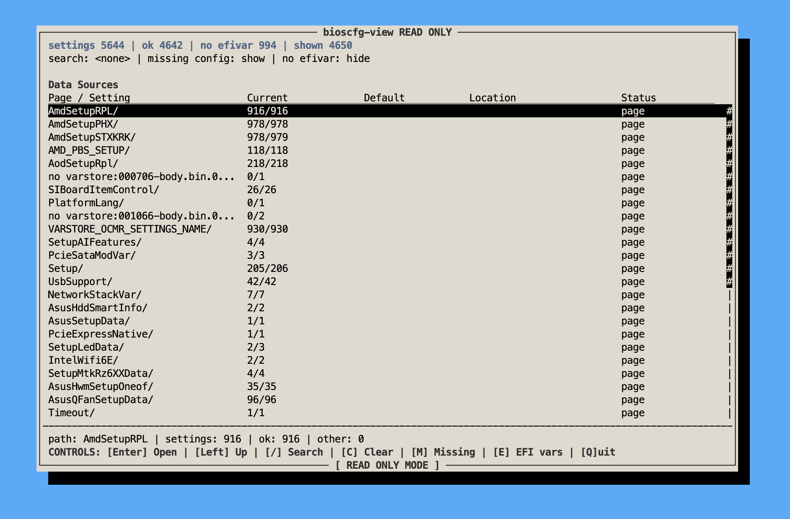
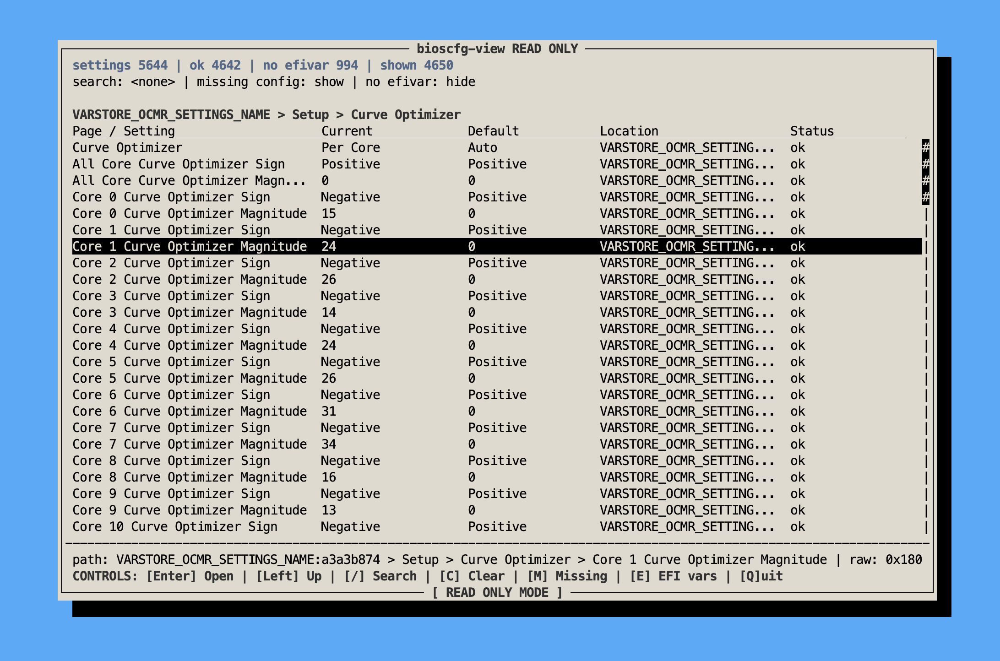

# bioscfg-view

`bioscfg-view` is a read-only Linux tool for inspecting BIOS setup settings.
It takes a vendor BIOS image, extracts UEFI HII/IFR setup metadata, reads live
EFI variables from `efivarfs`, and presents the decoded values as JSON, a table,
or an old-school curses TUI.

The tool does not write firmware variables. It is for inspection and debugging.

The TUI starts at the data-source level, then lets you drill into setup pages
without flattening every BIOS setting into one huge list:



## Background Terms

UEFI firmware is more like a small pre-OS runtime than a single BIOS menu. On a
typical boot it initializes CPU/chipset state, discovers and starts firmware
drivers, prepares boot services, picks a boot target, then hands control to the
OS loader. The exact phase names vary in how visible they are to users, but the
rough flow is:

```text
reset -> early platform init -> DXE drivers -> boot selection -> OS loader
```

The setup UI and the saved setup values are built from a few recurring objects:

- **Firmware image**
  The BIOS file from the vendor. Internally it contains firmware volumes,
  drivers, data sections, HII packages, and other platform code/data.

- **UEFI capsule**
  A wrapper around a firmware payload, commonly used by vendors for update
  files. ASUS `.CAP` files are this kind of wrapper. This project strips the
  capsule header before extracting the real firmware contents.

- **DXE**
  Driver Execution Environment. This is the phase where many UEFI drivers run
  and publish protocols/data used by later firmware code. Setup-related HII data
  is often found in DXE driver sections, though this tool scans broadly after
  `UEFIExtract` dumps the image.

- **HII**
  Human Interface Infrastructure. This is UEFI's framework for firmware UI data:
  strings, forms, fonts, images, keyboard layouts, and related package lists.
  For BIOS setup reading, the important parts are usually string packages and
  form packages.

- **IFR**
  Internal Forms Representation. This is the bytecode-like form language inside
  HII form packages. IFR describes setup pages, questions, options, defaults,
  VarStore links, and visibility conditions such as `SuppressIf`.

- **FormSet / Form / Question**
  The menu hierarchy. A FormSet is a top-level setup area, a Form is a page, and
  a Question is a setting shown on a page.

- **VarStore**
  IFR's description of where a question stores its value. For many setup items,
  this means a UEFI variable name, a vendor GUID, a byte offset, and a size.

- **EFI variable / NVRAM**
  Persistent firmware variables stored by the platform and exposed through UEFI
  runtime services. These are often casually called NVRAM variables. Setup values
  usually live here, but not every IFR VarStore necessarily maps cleanly to a
  readable live variable on the running OS.

- **efivarfs**
  Linux's filesystem view of EFI variables, normally mounted at
  `/sys/firmware/efi/efivars`. A file contains four bytes of attributes followed
  by the variable payload. This is what `bioscfg-view` reads for current values.

During boot, firmware drivers may register HII package lists so the firmware
setup browser can render setup pages. When a user changes a BIOS setting, the
firmware writes the selected raw value into the configured VarStore, often backed
by an EFI variable in NVRAM. Later boots and firmware drivers read those saved
bytes and apply platform behavior from them.

`bioscfg-view` works by reconstructing that relationship offline: read the BIOS
image to learn "what settings exist and where they live", then read `efivarfs`
to learn "what bytes this machine currently has stored there".

## How It Works

Modern UEFI setup screens are usually described through HII data. The firmware
contains HII package lists with string packages and form packages. The form
package contains IFR operations: formsets, forms, questions, options, defaults,
and VarStore references.

A BIOS question like "Core 0 Curve Optimizer Magnitude" is not stored as text in
NVRAM. IFR tells us:

- the question prompt and help text,
- its type, such as `oneof`, `numeric`, `checkbox`, or `string`,
- the VarStore name and GUID,
- the byte offset and size inside that VarStore,
- possible option labels and raw numeric values,
- rough menu context from formset/form hierarchy.

Linux exposes UEFI NVRAM variables through `efivarfs`, normally at
`/sys/firmware/efi/efivars`. Each file is named like:

```text
Setup-aaaaaaaa-bbbb-cccc-dddd-eeeeeeeeeeee
```

The first four bytes are EFI variable attributes. The remaining bytes are the
variable payload. `bioscfg-view` matches IFR VarStore name/GUID against these
files, then reads the configured offset to decode the current value.

The pipeline is:

1. `bioscfg/cli.py`
   Command-line entrypoint. It wires the pipeline together: extract schema,
   optionally write schema JSON, read efivars, decode current values, filter, and
   present output.

2. `bioscfg/extract.py`
   Normalizes the input BIOS image. Raw `.bin` files are copied as-is; vendor
   UEFI capsules such as ASUS `.CAP` are detected and stripped to the raw
   firmware payload. It then runs `UEFIExtract` to dump firmware sections.

3. `bioscfg/extract.py`
   Filters dumped sections before running IFR extraction. It keeps only sections
   that look like they contain both HII form and string packages, and deduplicates
   candidates by SHA-256.

4. `third-party/IFRExtractor-RS`
   Patched vendored extractor. Its JSON mode emits canonical package-list-local
   IFR JSON, pairing forms with the correct nearby string package instead of
   relying on text output parsing.

5. `bioscfg/ifr_json.py`
   Converts extractor JSON into the project schema: settings, paths, VarStores,
   options, defaults, source offsets, and unevaluated visibility metadata.

6. `bioscfg/efivarfs.py`
   Reads live EFI variables from `efivarfs`, strips the 4-byte attribute header,
   and indexes variables by `(name, guid)`.

7. `bioscfg/decode.py`
   Joins schema entries to live EFI variables and decodes current values from
   VarStore offsets. Missing or unsupported cases are kept as explicit statuses
   such as `missing_efivar`, `missing_varstore`, `missing_offset`, or
   `decoded_unknown_option`.

8. Presentation:
   `bioscfg/table.py` renders compact table output, `bioscfg/tui.py` provides the
   nested page-style TUI, and `bioscfg/display.py` holds shared formatting.

Small support files: `bioscfg/model.py` contains the shared dataclasses, and
`bioscfg/util.py` contains generic helpers such as file hashing.

Important limitation: visibility conditions such as `SuppressIf` and `GrayOutIf`
are preserved but not evaluated yet. The viewer can tell you what the firmware
describes and what bytes are currently present, but it does not currently prove
whether a hidden setup item is active in the firmware UI.

## Usage

Build the vendored tools first:

```bash
scripts/build-third-party.sh
```

Basic table output:

```bash
python3 -m bioscfg.cli tests/smoking/ROG-STRIX-B650E-I-GAMING-WIFI-ASUS-3854.CAP \
  --table \
  --grep "Curve Optimizer" \
  --limit 30
```

If you install the project in editable mode, the equivalent console command is
`bioscfg-view`:

```bash
python3 -m pip install -e .
bioscfg-view tests/smoking/ROG-STRIX-B650E-I-GAMING-WIFI-ASUS-3854.CAP --table
```

Open the TUI:

```bash
python3 -m bioscfg.cli tests/smoking/ROG-STRIX-B650E-I-GAMING-WIFI-ASUS-3854.CAP \
  --tui
```

Inside a page, values are shown beside their defaults, VarStore locations, and
decode status. For example, this Curve Optimizer page is decoded from live
`efivarfs` data on the smoke-test machine:



Use a RAM-backed cache while iterating:

```bash
CACHE="$(mktemp -d /tmp/bioscfg-cache.XXXXXX)"

python3 -m bioscfg.cli tests/smoking/ROG-STRIX-B650E-I-GAMING-WIFI-ASUS-3854.CAP \
  --cache "$CACHE" \
  --force \
  --json "$CACHE/b650ei-settings.json" \
  --schema-json "$CACHE/b650ei-schema.json" \
  --tui
```

ASUS BIOS zips may include `.CFG` metadata files. They are not needed by this
tool; use the `.CAP`.

### CLI Options

```text
bios
```

Required positional argument. Path to a BIOS image. Raw `.bin` and vendor UEFI
capsules such as ASUS `.CAP` are supported.

```text
--cache PATH
```

Cache directory for normalized images, UEFIExtract dumps, IFR JSON files, logs,
and manifests. Defaults to `.bioscfg-cache`.

```text
--force
```

Re-run extraction even if a matching cache manifest exists. Useful after changing
the extractor or parser.

```text
--normalize-only
```

Only normalize the BIOS input and print JSON describing the detected input
format, capsule header size, original SHA-256, and normalized SHA-256.

```text
--schema-json PATH
```

Write the schema before live EFI variable decoding. This is useful when you want
to inspect what the BIOS image describes without depending on the current
machine's NVRAM.

```text
--json PATH
```

Write decoded settings JSON after joining the schema with `efivarfs`. The output
contains `settings`, `summary`, BIOS image metadata, and per-setting `current`
decode status.

```text
--efivars PATH
```

Directory to read EFI variables from. Defaults to
`/sys/firmware/efi/efivars`. Use `--efivars none` to skip live NVRAM reads and
produce schema-only decode statuses. If your user cannot read some variables,
run with sufficient permissions; the tool still does not write variables.

```text
--table
```

Print a compact table with path, setting name, current value, default, VarStore
location, and decode status. If neither `--json` nor `--tui` is selected, table
output is the default.

```text
--limit N
```

Limit the number of rows printed by `--table`.

```text
--tui
```

Open the curses TUI. It uses a page-style hierarchy: first data source, then
top-level form pages, then deeper form paths, then settings.

Useful TUI keys:

```text
Up/Down move selection
PgUp    move one page up
PgDn    move one page down
Enter   open a page or setting details
Left    go up one page
/       search
C       clear search
M       show/hide missing config entries
E       show/hide entries without live EFI vars
Q       quit
```

Entries without live EFI vars are hidden by default. Missing config/schema-side
entries are controlled separately with `M`.

```text
--grep TEXT
```

Case-insensitive filter applied to path, prompt, help text, VarStore name/GUID,
and decoded current value. Works with table and TUI output.

```text
--varstore NAME
```

Filter settings to a specific VarStore name, for example `Setup` or
`AodSetupRpl`.

### Tool Lookup

`bioscfg-view` searches for tools in this order:

- `UEFIEXTRACT` environment variable, then local vendored/build paths, then
  `uefiextract` on `PATH`.
- `IFREXTRACT` environment variable, then local vendored build paths, then
  `ifrextractor` on `PATH`.

If either tool is missing, build the vendored tools:

```bash
scripts/build-third-party.sh
```
